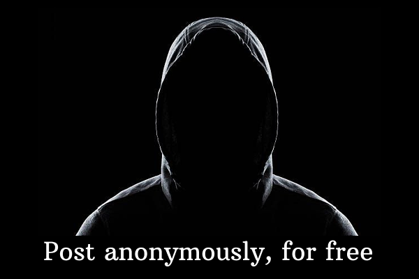

# AnonPost

A Farcaster miniapp/webapp that lets users post anonymously on the Farcaster Protocol. Built with Next.js 15 and the Farcaster SDK.



## ✨ Features

- **Anonymous Posting** - Cast to Farcaster without revealing your identity
- **Token-Gated Access** - Requires minimum $AnonPost tokens to post (anti-spam measure)
- **Multiple Cast Types** - Support for regular casts, replies, and quote casts
- **Image Uploads** - Attach images to your anonymous posts
- **@ Mentions** - Tag other Farcaster users in your casts
- **Wallet Integration** - Connect via Farcaster miniapp wallet connector when using miniapp and Metamask or any other wallet when using webapp
- **Cooldown System** - 60-second cooldown between posts to prevent spam
- **Real-time Balance Check** - View your token balance before posting

## 🛠️ Tech Stack

- **Framework**: [Next.js 15](https://nextjs.org/) (App Router)
- **Farcaster SDK**: [@farcaster/miniapp-sdk](https://www.npmjs.com/package/@farcaster/miniapp-sdk)
- **Blockchain**: [@farcaster/core](https://www.npmjs.com/package/@farcaster/core)
- **Wallet**: [wagmi](https://wagmi.sh/) + Farcaster miniapp connector
- **Styling**: [Tailwind CSS](https://tailwindcss.com/)
- **Icons**: [Lucide React](https://lucide.dev/)
- **State Management**: [TanStack Query](https://tanstack.com/query)

## 📦 Installation

1. **Clone the repository**

   ```bash
   git clone https://github.com/sah-ban/AnonPost.git
   cd AnonPost
   ```

2. **Install dependencies**

   ```bash
   yarn install
   ```

3. **Set up environment variables**

   Copy the example env file and fill in the values:

   ```bash
   cp .env.example .env
   ```

   | Variable                | Description                            |
   | ----------------------- | -------------------------------------- |
   | `NEXT_PUBLIC_URL`       | Your app's public URL                  |
   | `PRIVATE_KEY`           | Ed25519 signer private key for casting |
   | `NEXT_PUBLIC_IMGBB_KEY` | imgBB API key for image uploads        |
   | `HUB_URL`               | Farcaster Hub URL for submitting casts |

4. **Run the development server**

   ```bash
   yarn dev
   ```

   Open [http://localhost:3000](http://localhost:3000) in your browser.

## 🚀 Usage

1. Open in browser or miniapp
2. Connect your wallet
3. Ensure you have enough **$AnonPost** token
4. Write your anonymous cast
5. Optionally add images or reply/quote other casts
6. Hit publish!

## 📁 Project Structure

```
src/
├── app/
│   ├── api/
│   │   ├── create-cast/    # API route for creating casts
│   ├── .well-known/        # Farcaster miniapp manifest
│   ├── page.tsx            # Main page with Frame metadata
│   ├── layout.tsx          # Root layout
│   └── providers.tsx       # React Query + Wagmi providers
├── components/
│   ├── CastComposer.tsx    # Main composer component
│   └── providers/          # Wagmi provider configuration
```

## 📜 License

Licensed under the **Apache License 2.0**  
Copyright © 2026 AnonPost

You may not use this project except in compliance with the License.  
You may obtain a copy of the License at: [http://www.apache.org/licenses/LICENSE-2.0](http://www.apache.org/licenses/LICENSE-2.0)

## 👨‍💻 Developer

**[@cashlessman.eth](https://farcaster.xyz/cashlessman.eth)**  
Built for **Farcaster**
